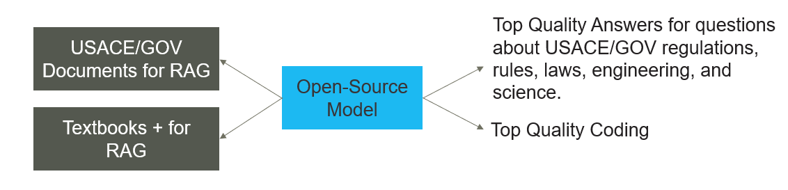

# Deployment Laptop — standalone, self-hosted Project SPK

This is the canonical doc for the **Deployment Laptop** track: local laptop
development, split off from the hosted Project SPK app on Railway/OpenAI so
it can evolve on its own schedule. Production is untouched by anything here.

If you're looking for the detailed step-by-step mechanics (WSL2 install,
desktop icon, model swapping, agent mode internals, offline behavior), see
**[LOCAL_PROTOTYPE.md](LOCAL_PROTOTYPE.md)** — this doc covers the
higher-level shape of the Deployment Laptop build and the two things that
changed with the split: where the code lives, and the two-corpus RAG setup
below.

## Architecture



In words:

- **Two RAG corpora**, indexed separately but searched together:
  1. **USACE/GOV Documents for RAG** — ER/EM/EP/EC/ECB/ETL/UFC/UFGS, Army
     Regulations, FAR/DFARS/AFARS, etc. (this is the existing "Master
     Library" folder — see LOCAL_PROTOTYPE.md's bulk-loading section).
  2. **Textbooks for RAG** — engineering and science reference material,
     for grounding answers that need general technical background beyond
     what a regulation itself states.
- **One open-source model**, running locally via Ollama, serving both:
  1. **Top-quality answers** to questions about USACE/GOV regulations,
     rules, laws, engineering, and science — grounded in whichever corpus
     (or both) is relevant to the question.
  2. **Top-quality coding** help — the same model, used as a general
     coding assistant. This isn't a separate feature or tool; it's a model
     capability requirement (see "Model choice" below).

Nothing here required new retrieval logic: the vector index already
searches all indexed content regardless of source, so a question that
needs both a specific ER and a general engineering concept from a textbook
can pull from both in the same answer. The only genuinely new piece is
*labeling* which corpus a document came from (see below), so the Document
Library and the agent can tell them apart when it matters (e.g. preferring
the actual regulation text over a textbook's paraphrase of it).

## Where the code lives

Code for this track lives at:

```
C:\Users\CYRUS\Documents\Deployment Laptop
```

Since the app runs inside WSL2 (see LOCAL_PROTOTYPE.md for why), that
Windows path is this path from inside Ubuntu:

```bash
/mnt/c/Users/CYRUS/Documents/Deployment Laptop
```

Clone there instead of into the WSL2 home directory:

```bash
mkdir -p "/mnt/c/Users/CYRUS/Documents/Deployment Laptop"
cd "/mnt/c/Users/CYRUS/Documents/Deployment Laptop"
git clone https://github.com/prattw/project_SPK.git .
git checkout cursor/deployment-laptop-a548   # this branch, until merged
./scripts/setup_local_prototype.sh
```

**One trade-off to know about:** WSL2 accesses Windows drives (`/mnt/c/...`)
through a network-like bridge that's noticeably slower for heavy disk I/O
than WSL2's own native Linux filesystem. For this app that mostly means
slower PDF ingestion and ChromaDB index writes — not slower chat, since
Ollama's model weights are cached in its own store regardless of where the
repo sits. If large bulk-ingest runs (thousands of pages) feel painfully
slow from `/mnt/c/`, cloning into the WSL2 home directory instead
(`~/project_SPK`, as the original LOCAL_PROTOTYPE.md steps show) will be
faster — the Windows path is for convenience (Explorer access, a normal
Windows-looking project folder), not a hard requirement.

## Setting up the two RAG corpora

Both corpora use the same bulk-ingest script, just pointed at different
folders and tagged with `--corpus` so they stay distinguishable later
(shown in the Document Library and passed to the agent's tools):

```bash
source .venv/bin/activate

# 1. USACE/GOV documents (the "Master Library" folder)
python scripts/bulk_ingest.py "/mnt/c/Users/CYRUS/Documents/Master Library" --corpus gov

# 2. Textbooks
python scripts/bulk_ingest.py "/mnt/c/Users/CYRUS/Documents/Textbooks" --corpus textbook
```

The `--corpus` tag is a label only — both corpora land in the same vector
index and are searched together for every question, the same as before.
It exists so the Document Library and the agent's `list_documents` tool
can tell a regulation apart from a textbook when it matters (the agent is
prompted to prefer the actual regulation over a textbook's paraphrase for
anything about a specific rule — see `app/agent.py`).

Run `bulk_ingest.py --help` for the full usage, including how it safely
resumes an interrupted run and skips files already indexed.

## Model choice: quality answers *and* quality coding

The diagram's two outputs are both requirements on the same model, not two
different features:

- **Regulatory/engineering/science RAG answers** need a model that follows
  instructions carefully, cites what it's given, and doesn't hallucinate —
  general-purpose instruct models are tuned for exactly this.
- **Top-quality coding** needs a model with strong code training.

These pull in the same direction more than they conflict: modern
general-instruct models (Qwen2.5-Instruct, Llama 3.1+-Instruct) are trained
on large amounts of code and are genuinely competent coders, while
staying strong at grounded RAG and instruction-following. That's why
`setup_local_prototype.sh` already defaults to Qwen2.5-Instruct at a size
matched to your hardware (see LOCAL_PROTOTYPE.md's sizing table) — it's a
reasonable single model for both jobs.

If you specifically want to push harder on coding at the cost of some RAG
polish, a coder-specialized variant (e.g. `qwen2.5-coder:14b`) will write
better code but tends to follow citation/formatting instructions less
reliably and can be weaker at general reasoning. Try it with:

```bash
./scripts/switch_local_model.sh qwen2.5-coder:14b
```

and switch back with the same command if it doesn't hold up on the
regulatory side of the work. There's no single right answer here yet —
this is exactly the kind of thing worth comparing side by side on real
questions from both use cases before settling on a default.

## Status

- Runs fully offline once set up — see LOCAL_PROTOTYPE.md's "Working fully
  offline" section for exactly what does and doesn't need internet.
- Experimental agent mode (tool-calling: search the library, read a
  document, list what's indexed, draft a `.docx` report) is available and
  on by default in `.env.local.example` — see LOCAL_PROTOTYPE.md's "Agent
  mode" section.
- Not yet built: any retrieval-time filtering by corpus (e.g. "answer using
  only textbooks"). The `corpus` tag is stored on every chunk today, so
  that's a small, well-scoped addition later if it turns out to be useful
  — flag it if you want it prioritized.
- Production (Railway + OpenAI API) is completely unaffected by any of
  this — same as the original local-prototype effort this branch splits
  off from.
